# Mermaid Diagrams

Create professional Mermaid diagrams from text definitions. Mermaid diagrams are
version-controllable, render natively in GitHub, GitLab, VS Code, Obsidian, and Notion, and can be
exported to SVG, PNG, or ASCII art.

## Choosing the Right Diagram Type

Match the content to the best diagram type:

| Content | Diagram Type | Declaration |
| --- | --- | --- |
| Process with decisions | Flowchart | `flowchart TD` |
| API / system interactions | Sequence | `sequenceDiagram` |
| Database schema | ERD | `erDiagram` |
| Domain model / OOP design | Class | `classDiagram` |
| System architecture (multi-level) | C4 | `C4Context` / `C4Container` / `C4Component` |
| Infrastructure / cloud services | Architecture | `architecture-beta` |
| State machine / lifecycle | State | `stateDiagram-v2` |
| Project timeline | Gantt | `gantt` |
| Branching strategy | Git Graph | `gitGraph` |
| Data proportions | Pie Chart | `pie` |

When the choice is ambiguous, default to a flowchart for processes or a sequence diagram for
interactions.

## Quick-Start Examples

### Flowchart

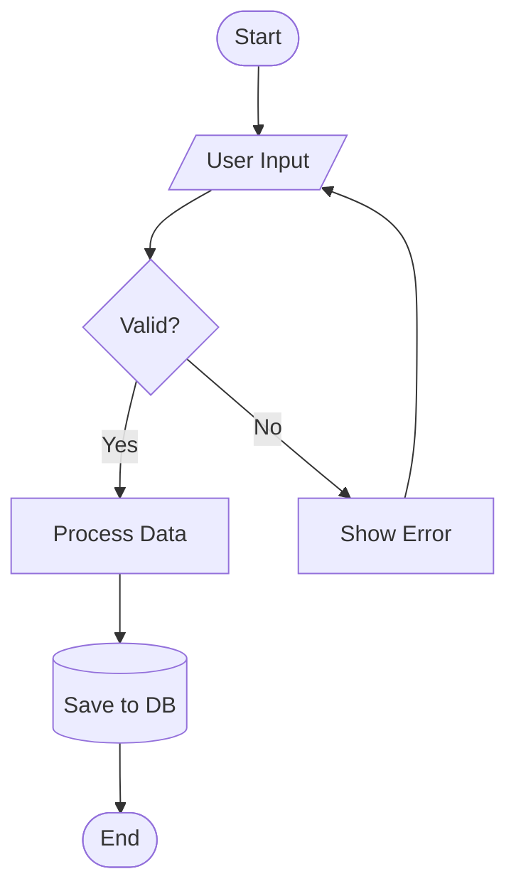

**Node shapes:** `[Rectangle]` process, `([Rounded])` terminal, `{Diamond}` decision,
`[/Parallelogram/]` I/O, `[(Cylinder)]` database, `((Circle))` connector.

**Directions:** `TD` top-down, `LR` left-right, `BT` bottom-up, `RL` right-left.

### Sequence Diagram

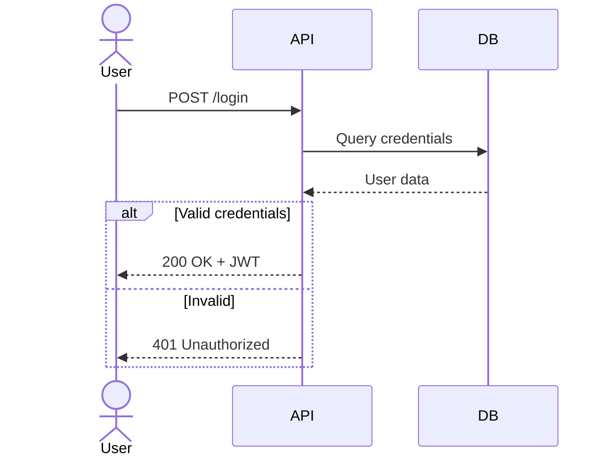

**Arrow types:** `->>` sync request, `-->>` async response, `-)` async fire-and-forget, `-x` lost
message. Append `+`/`-` for activation: `->>+` activates, `-->>-` deactivates.

**Blocks:** `alt`/`else`/`end`, `opt`/`end`, `par`/`and`/`end`, `loop`/`end`, `break`/`end`.

### ERD

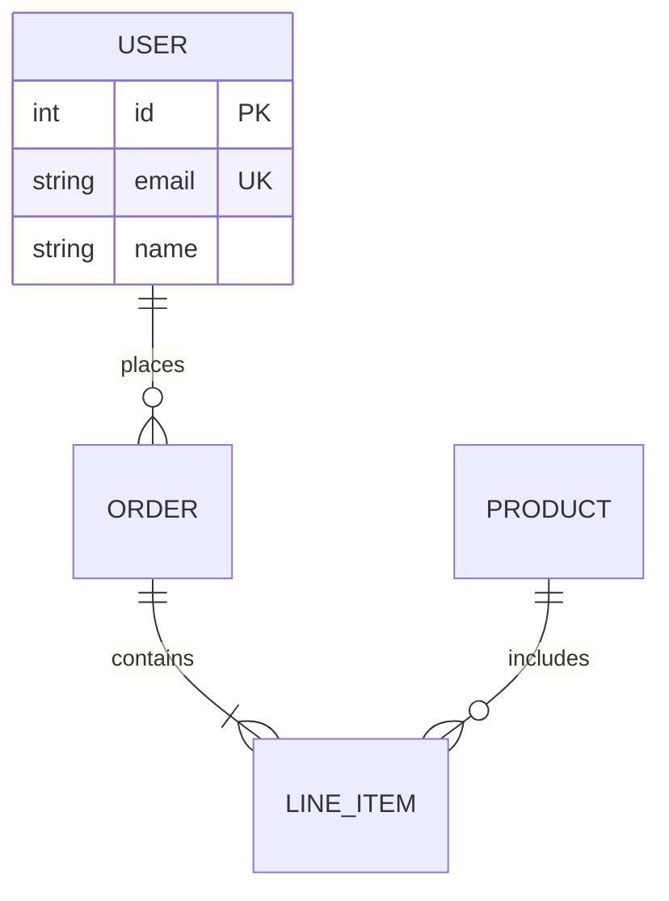

**Cardinality:** `||` exactly one, `o|` zero or one, `}|` one or more, `}o` zero or more.
**Lines:** `--` non-identifying, `..` identifying.

### Class Diagram

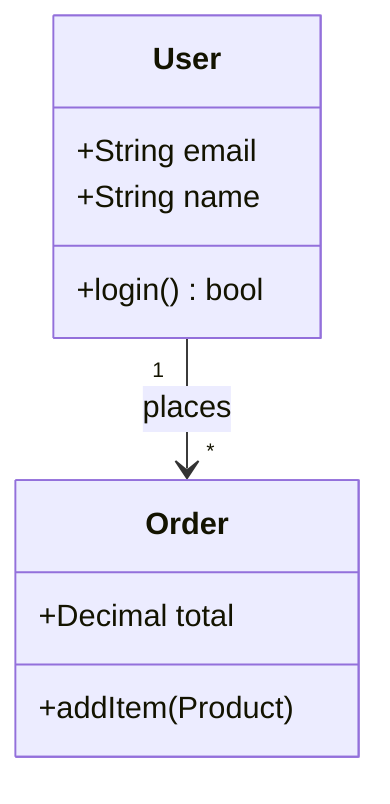

**Relationships:** `<|--` inheritance, `*--` composition, `o--` aggregation, `<..` dependency,
`<|..` realization, `--` association.

### C4 Architecture

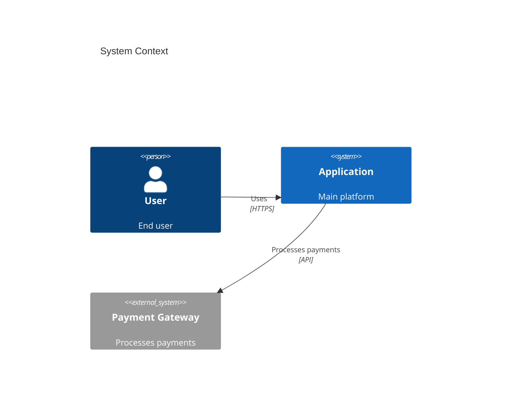

Three levels of detail: `C4Context` (systems in environment), `C4Container` (applications and data
stores), `C4Component` (internal structure).

### State Diagram

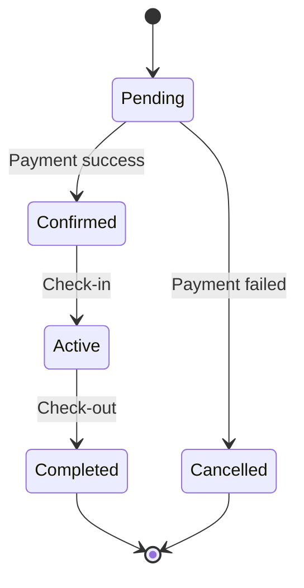

Use `[*]` for initial/final states, `<<choice>>` for decision points, and `--` for concurrency.

## Critical Syntax Rules

These rules prevent the most common rendering failures. Internalize them before writing any diagram.

### Numbered labels break flowcharts

Text like `[1. First Step]` triggers a Mermaid list-parsing error. Fix it:

```text
WRONG:  [1. Perception]
RIGHT:  [1.Perception]          (remove space after period)
RIGHT:  [(1) Perception]        (parenthesized number)
RIGHT:  [Step 1: Perception]    (prefix with text)
```

### Subgraph naming requires IDs

Spaces in subgraph names without an ID cause parse errors:

```text
WRONG:  subgraph AI Agent Core
RIGHT:  subgraph agent["AI Agent Core"]
```

Always reference subgraphs by their ID, not display text: `A --> agent`, not `A --> AI Agent Core`.

### Special characters need escaping

Wrap node labels containing parentheses, quotes, or slashes in double quotes:

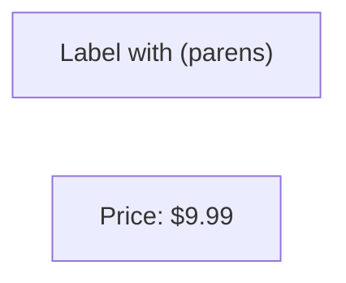

### Use pipe syntax for edge labels

Always use `-->|label|` for edge labels. The space-dash syntax `-- label -->` can cause incomplete
renders in some environments.

### No emoji in node text

Emoji characters break many Mermaid renderers. Use text labels or color coding instead.

For the complete syntax error prevention guide, read
[references/syntax-rules.md](references/syntax-rules.md).

## Styling and Theming

### Inline class styling

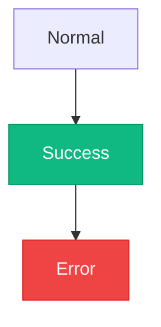

### Theme configuration via frontmatter

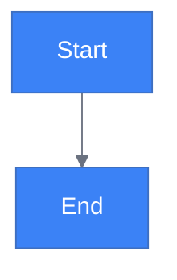

**Built-in themes:** `default`, `forest`, `dark`, `neutral`, `base`.

**Layout engines:** `dagre` (default, balanced) and `elk` (advanced, better for complex diagrams).

**Look options:** `classic` (default) and `handDrawn` (sketch-style).

For full theming reference including custom variables, ELK configuration, click events, and
accessibility, read [references/advanced-features.md](references/advanced-features.md).

## Rendering to SVG, PNG, and ASCII

The `scripts/` directory contains rendering tools powered by the `beautiful-mermaid` npm package.
Dependencies auto-install on first run.

### Render a single diagram to SVG

```bash
node scripts/render.mjs --input diagram.mmd --output diagram.svg --theme tokyo-night
```

Supports 15+ named themes. Run `node scripts/themes.mjs` to list them. Custom colors are also
supported via `--bg`, `--fg`, `--accent`, `--line`, `--muted`, `--surface`, `--border` flags. Use
`--transparent` for transparent backgrounds.

### Render to ASCII art

```bash
node scripts/render.mjs --input diagram.mmd --format ascii --use-ascii
```

Useful for terminal output, plain-text READMEs, or environments without image support.

### Batch render a directory

```bash
node scripts/batch.mjs \
  --input-dir ./diagrams \
  --output-dir ./output \
  --theme tokyo-night \
  --workers 4
```

Processes all `.mmd` files in parallel. Supports the same `--theme`, `--format`, and color options
as the single renderer.

### Render inline code

```bash
node scripts/render.mjs --code "graph TD; A-->B" --output diagram.svg --theme tokyo-night
```

Use `--code` instead of `--input` to pass Mermaid source directly on the command line — handy for
one-off diagrams without creating a `.mmd` file.

### Theme selection guide

| Context | Recommended Theme |
| --- | --- |
| Dark-mode documentation | `tokyo-night` |
| Light-mode documentation | `github-light` |
| Vibrant, high contrast | `dracula` |
| Minimalist dark | `nord` |
| Warm light mode | `catppuccin-latte` |
| Printable / high contrast | `zinc-light` |

## Layout Patterns

Reusable structural patterns for common diagram shapes.

### Swimlane (grouping related steps)

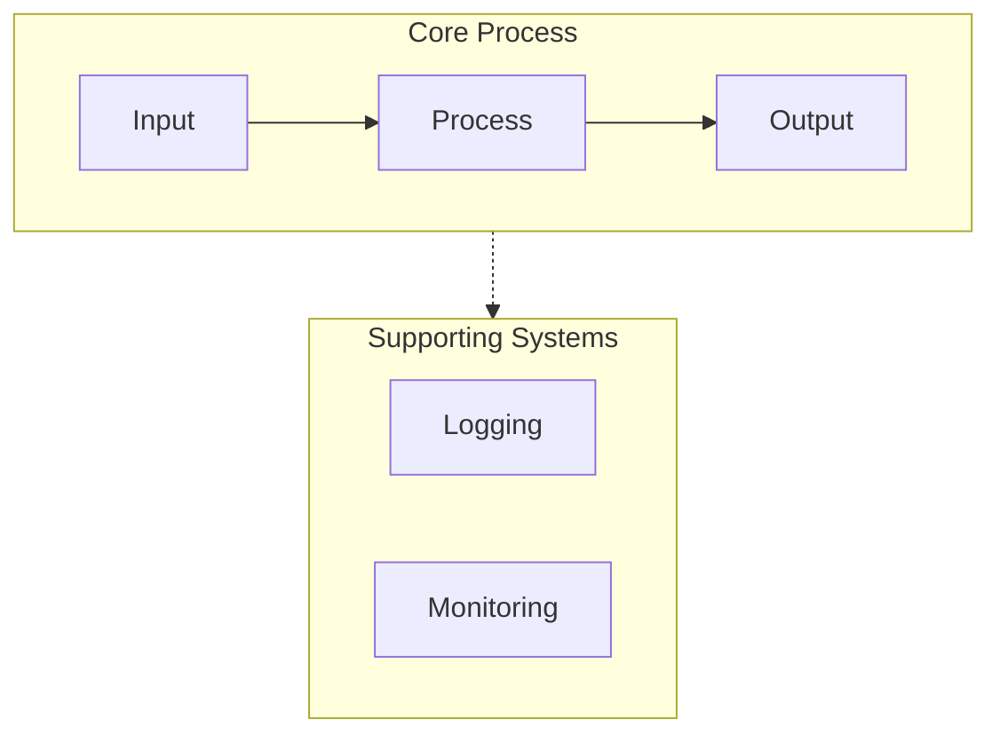

### Feedback loop

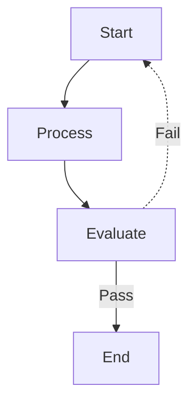

### Hub and spoke

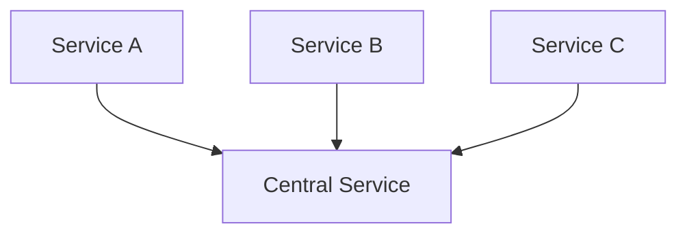

### Decision tree

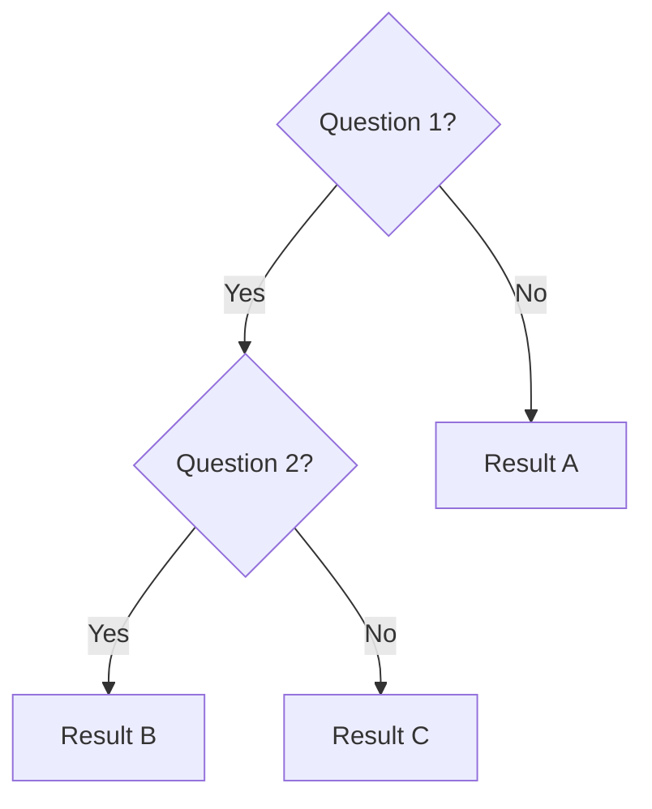

## Best Practices

1. **Start simple** — begin with core entities, add details incrementally
2. **One concept per diagram** — split large systems into focused views
3. **Under 20 nodes** — keep diagrams readable; use subgraphs to group beyond that
4. **Meaningful labels** — clear, descriptive names make diagrams self-documenting
5. **Consistent direction** — pick top-down or left-right and stick with it
6. **Comment with `%%`** — explain complex relationships inline
7. **Store as `.mmd` files** — version-control diagrams alongside code
8. **Validate before committing** — test at [mermaid.live](https://mermaid.live) or in VS Code
9. **Use color semantically** — green for success paths, red for errors, not decoratively
10. **Keep diagrams updated** — stale diagrams are worse than no diagrams

## Reference Guide

Consult these files for in-depth syntax, examples, and patterns per diagram type. Read only the file
relevant to your current task — there is no need to load them all.

| Topic | Reference File |
| --- | --- |
| Flowchart nodes, connections, subgraphs | [references/flowcharts.md](references/flowcharts.md) |
| Sequence participants, messages, blocks | [references/sequence-diagrams.md](references/sequence-diagrams.md) |
| Class relationships, DDD patterns | [references/class-diagrams.md](references/class-diagrams.md) |
| ERD cardinality, schemas, DB patterns | [references/erd-diagrams.md](references/erd-diagrams.md) |
| C4 context, container, component levels | [references/c4-diagrams.md](references/c4-diagrams.md) |
| Architecture-beta, cloud icons | [references/architecture-diagrams.md](references/architecture-diagrams.md) |
| Themes, ELK layout, accessibility | [references/advanced-features.md](references/advanced-features.md) |
| Syntax error prevention, platform quirks | [references/syntax-rules.md](references/syntax-rules.md) |

## Quality Checklist

Verify before outputting any diagram:

- [ ] No `number. space` patterns in node text
- [ ] All subgraphs use `id["Display Name"]` format
- [ ] All arrows use correct syntax (`-->`, `-.->`, `==>`)
- [ ] Colors applied consistently with `classDef`
- [ ] Layout direction specified (`TD`, `LR`, etc.)
- [ ] No emoji in node text
- [ ] No ambiguous node references (use IDs, not display text)
- [ ] Renders correctly in target platform (GitHub, Obsidian, VS Code)
