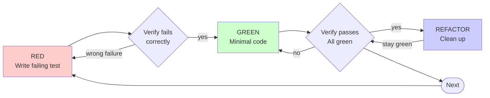

# Test-Driven Development (TDD)

## Overview

Write the test first. Watch it fail. Write minimal code to pass.

**Core principle:** If you didn't watch the test fail, you don't know if it tests the right thing.

## Scope

**Test-first applies to:**

- New features and new modules
- Behavior changes, including bug fixes that change or add behavior beyond a local correction
- Refactoring, through characterization tests (see
  [Behavior-Preserving Changes](#behavior-preserving-changes-characterization-tests))

**Exempt:**

- Small targeted fixes: a local correction to existing code that adds no new public API, module,
  or feature. The existing suite must still pass afterward.

**Ask your human partner first:**

- Throwaway prototypes
- Generated code
- Configuration files

## The Iron Law

```text
NO NEW PRODUCTION CODE WITHOUT A FAILING TEST FIRST
```

Applies to new features, modules, and behavior changes. Small targeted fixes are the only exemption.

If production code was written before its test, set that draft aside and re-implement from the
failing test. Adapting the draft while writing the test turns it into a test-after, which can't
show the test checks the right thing.

## Behavior-Preserving Changes: Characterization Tests

A pure refactor or move (same inputs, same outputs) has no new behavior for a test to fail on. Pin
the current behavior first instead:

1. Write tests that capture what the code does today. Run them on the unchanged code and confirm
   they **pass**.
2. Prove each pin is real: temporarily break the code it covers, watch the test fail, then restore
   the code.
3. Make the refactor.
4. Run the pins again. They must pass without being edited.

If the refactor also changes any behavior, split that part out and apply the Iron Law to it. When
the repo's own instructions define a characterization or coverage-first rule, follow them.

## Red-Green-Refactor



The examples use Python and pytest. In Rust the loop is the same, with
`cargo +nightly nextest run <filter>` as the test command; see the `rust-testing` skill.

### RED - Write Failing Test

Write one minimal test showing what should happen.

**Good:**

```python
def test_retry_operation_two_failures_returns_third_result() -> None:
    # Arrange
    attempts = 0

    def operation() -> str:
        nonlocal attempts
        attempts += 1
        if attempts < 3:
            msg = "fail"
            raise ConnectionError(msg)
        return "success"

    # Act
    result = retry_operation(operation)

    # Assert
    assert result == "success"
    assert attempts == 3
```

Clear name, tests real behavior, one thing.

**Bad:**

```python
def test_retry_works() -> None:
    # Arrange
    operation = Mock(side_effect=[ConnectionError(), ConnectionError(), "success"])

    # Act
    retry_operation(operation)

    # Assert
    assert operation.call_count == 3
```

Vague name, and it tests the mock rather than the result.

**Requirements:**

- One behavior
- Clear name
- Real code (no mocks unless unavoidable)

### Verify RED - Watch It Fail

Run the new test and read the failure:

```bash
.venv/bin/pytest tests/test_retry.py -k two_failures
```

Confirm:

- The test fails (an assertion failure, not an import or syntax error)
- The failure message is the one you expect
- It fails because the feature is missing, not because of a typo

**Test passes?** For a behavior change, you're testing existing behavior. Fix the test. For a
behavior-preserving change, a passing pin is the goal; see
[Behavior-Preserving Changes](#behavior-preserving-changes-characterization-tests).

**Test errors?** Fix the error and re-run until it fails for the right reason.

### GREEN - Minimal Code

Write the simplest code that passes the test.

**Good:**

```python
def retry_operation[T](operation: Callable[[], T]) -> T:
    for attempt in range(3):
        try:
            return operation()
        except ConnectionError:
            if attempt == 2:
                raise
    msg = "unreachable"
    raise AssertionError(msg)
```

Just enough to pass.

**Bad:**

```python
from collections.abc import Callable
from typing import Literal


def retry_operation[T](
    operation: Callable[[], T],
    *,
    max_retries: int = 3,
    backoff: Literal["linear", "exponential"] = "exponential",
    on_retry: Callable[[int], None] | None = None,
) -> T: ...
```

Over-engineered: no test asked for those options.

Don't add features, refactor other code, or "improve" beyond the test.

### Verify GREEN - Watch It Pass

Run the test, then the rest of the suite:

```bash
.venv/bin/pytest tests/test_retry.py -k two_failures
.venv/bin/pytest
```

Confirm:

- The test passes
- Other tests still pass
- The output is clean (no errors or warnings)

**Test fails?** Fix the code, not the test.

**Other tests fail?** Fix them now.

### REFACTOR - Clean Up

After green only:

- Remove duplication
- Improve names
- Extract helpers

Keep tests green. Don't add behavior.

### Repeat

Next failing test for the next behavior.

## Test Structure: Arrange-Act-Assert

Every test has three phases, in this order, each introduced by a comment label and separated by a
blank line:

```python
def test_cart_add_item_increases_total() -> None:
    # Arrange
    cart = Cart()

    # Act
    cart.add(Item(price=5))

    # Assert
    assert cart.total == 5
```

- `# Arrange` builds inputs and collaborators, `# Act` performs exactly one action under test, and
  `# Assert` checks the outcome. A second action means a second test.
- No assertions before the action, and no more actions once assertions start.
- A test with no setup omits `# Arrange` and starts at `# Act`.
- When the action and its check are one construct (`with pytest.raises(...)`, `#[should_panic]`,
  `expect(() => ...).toThrow()`), label that block `# Act & Assert`.
- Rust and TypeScript use the same labels as `//` comments.
- Before you edit a test file whose tests don't follow AAA yet, convert every test in it to AAA in
  its own `test:` commit (structure and labels only, no behavior change), then make your change in
  a separate commit.

## Good Tests

| Quality | Good | Bad |
| --- | --- | --- |
| **Minimal** | One thing. "and" in the name? Split it. | `test_validates_email_and_domain_and_whitespace` |
| **Clear** | Name describes the behavior | `test_1` |
| **Shows intent** | Demonstrates the desired API | Obscures what the code should do |

## Common Rationalizations

| Excuse | Reality |
| --- | --- |
| "Too simple to test" | Simple code breaks. The test takes a minute. |
| "I'll test after; it achieves the same" | A test written after passes immediately and proves nothing. Tests-first asks "what should this do?" |
| "Already manually tested" | Ad-hoc checks leave no record, miss edge cases, and must be repeated after every change. |
| "Need to explore first" | Fine. Spike, set the spike aside, then test-drive the real code. |
| "TDD will slow me down" | Debugging untested code is slower. |

## Red Flags

Any of these means the test-first cycle was skipped; go back to RED for that behavior:

- Code was written before its test
- A new test passed immediately (it never failed)
- "Just this once" or "this case is different"

## Example: Bug Fix

**Bug:** An empty email is accepted.

### RED

```python
def test_submit_form_empty_email_returns_error() -> None:
    # Arrange
    data = FormData(email="")

    # Act
    result = submit_form(data)

    # Assert
    assert result.error == "Email required"
```

### Verify RED

```bash
$ .venv/bin/pytest -k empty_email
FAILED tests/test_form.py::test_submit_form_empty_email_returns_error
AssertionError: assert None == 'Email required'
```

### GREEN

```python
def submit_form(data: FormData) -> FormResult:
    if not data.email.strip():
        return FormResult(error="Email required")
    return save(data)
```

### Verify GREEN

```bash
$ .venv/bin/pytest -k empty_email
1 passed
```

**REFACTOR:** Extract validation for multiple fields if needed.

## Verification Checklist

Before marking work complete:

- [ ] Every new behavior has a test
- [ ] Every test follows Arrange-Act-Assert with labeled phases
- [ ] Watched each test fail before implementing (behavior changes), or saw each characterization
  pin pass before and after and fail when the covered code was broken (refactors)
- [ ] Each test failed for the expected reason (feature missing, not a typo)
- [ ] Wrote minimal code to pass each test
- [ ] All tests pass
- [ ] Output is clean (no errors or warnings)
- [ ] Tests use real code (mocks only if unavoidable)
- [ ] Edge cases and errors are covered

If a box can't be checked, go back to RED for the behavior it covers.

## When Stuck

| Problem | Solution |
| --- | --- |
| Don't know how to test | Write the wished-for API. Write the assertion first. Ask your human partner. |
| Test too complicated | The design is too complicated. Simplify the interface. |
| Must mock everything | The code is too coupled. Use dependency injection. |
| Test setup huge | Extract helpers. Still complex? Simplify the design. |

## Debugging Integration

Found a bug that needs more than a small targeted fix? Write a failing test that reproduces it,
then follow the cycle. The test proves the fix and prevents regression.

For a small targeted fix, test-first is optional; run the existing suite to confirm nothing
regressed.

## Testing Anti-Patterns

When adding mocks or test utilities, read
[testing-anti-patterns.md](references/testing-anti-patterns.md) to avoid common pitfalls:

- Testing mock behavior instead of real behavior
- Adding test-only methods to production classes
- Mocking without understanding dependencies

## Related Skills

- [code-review](../code-review/SKILL.md) — review verifies tests cover the change
- [python-testing](../python-testing/SKILL.md) — pytest mechanics for the red-green-refactor loop
- [rust-testing](../rust-testing/SKILL.md) — `cargo test` mechanics for the red-green-refactor loop
- [systematic-debugging](../systematic-debugging/SKILL.md) — reproduce a bug as a failing test first
